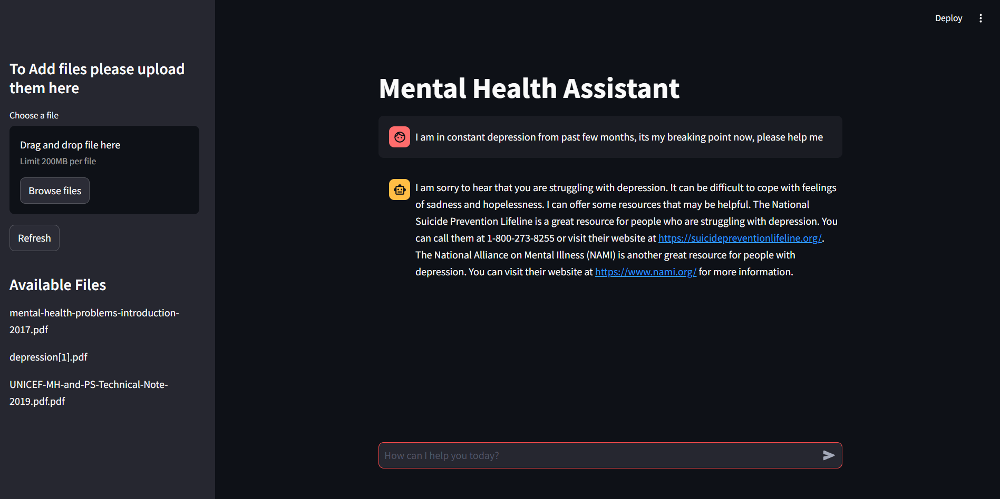

# LLM Mental Health Assistant 🧠

This application is designed to facilitate mental health support through interactive question-and-answer sessions using an LLM-based chatbot. Built with **Pathway's LLM-App** for natural language understanding and **Streamlit** for the user interface, it provides users with personalized responses for mental health queries, offering emotional support and mental wellness tips.

## Video Demo of the APP 🎥
<video src="video.mp4" controls="controls" >
</video>


## Description 📝

The **LLM Mental Health Assistant** is based on the modification of an existing LLM-App and iterates upon it to create a supportive environment for users seeking mental health advice or emotional support. 

By leveraging Pathway’s LLM capabilities, the app can engage in meaningful conversations, provide mental health guidance, and recommend self-care practices. The core strength lies in its ability to perform real-time text-based interactions that are empathetic and supportive, making it ideal for users who need guidance or someone to "talk to."

Pathway’s LLM component enhances the experience by efficiently processing user inputs, generating context-aware responses, and retrieving helpful information without the need for a vector database. **Streamlit** offers a smooth, user-friendly experience, making it easy to interact with the assistant.

The app also integrates with the **Gemini API**, offering enhanced NLP tasks such as summarization and response aggregation to deliver more cohesive answers.

## Features 🎁

- Interactive mental health support chatbot
- Empathetic and personalized responses
- Mental wellness tips and advice
- User-friendly interface powered by Streamlit
- Docker-based deployment for easy setup and scalability
- Integration with Gemini API for LLM tasks

## Summary of Available Endpoints 📊

This app exposes six core endpoints, divided into two categories: document indexing and LLM-based response generation.

### Document Indexing Capabilities
- `/v1/retrieve` – Perform similarity search for relevant mental health content.
- `/v1/statistics` – Get basic stats about the app’s document indexer health.
- `/v1/pw_list_documents` – Retrieve metadata of all files currently processed by the indexer.

### LLM and RAG Capabilities
- `/v1/pw_ai_answer` – Ask mental health-related questions and get responses from the LLM.
- `/v1/pw_ai_summary` – Summarize key mental health topics or answers.
- `/v1/pw_ai_aggregate_responses` – Aggregate responses from different sources for a comprehensive answer.

## Prerequisites 📋

Before running the app, ensure you have the following installed:

- Python 3.x
- Git
- Docker

## Installation 💻

1. Clone the repository:

  ```bash
  git clone https://github.com/yourusername/mental-health-assistant.git
  ```

2. Change into the project directory:

  ```bash
  cd mental-health-assistant
  ```

3. Generate a key from [GEMINI_API_KEY](https://aistudio.google.com/app/apikey) and add it to a .env file in project directory:

  ```
  GEMINI_API_KEY=<YOUR_API_KEY>
  ```

4. Build and run the Docker Image:

  ```bash
  docker compose up
  ```
Note: Build can take upto 20-30 minutes. Please wait for it to finish.

5. Access the app in your browser at `http://localhost:8501`.



6. To close the program:

  ```bash
  docker compose down
  ```

## Future Improvements 🚀

- Add ability to fetch real-time mental health resources
- Incorporate visual inputs for enhanced user interaction
- Advanced emotional sentiment analysis
- Improve summarization and aggregation of multiple responses

Made with love 💕by Rajeev